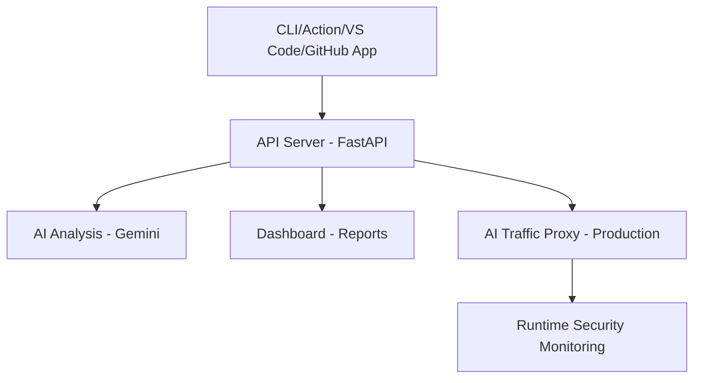

# Tavo AI - The Complete AI Security Platform

<div align="center">


[](https://tavoai.net)
[](https://github.com/TavoAI)

**The most comprehensive AI security copilot for developers and organizations**

*Secure your AI implementations with advanced threat detection, compliance automation, and enterprise-grade protection*

[🚀 Get Started](https://tavoai.net) • [📚 Documentation](https://docs.tavoai.net) • [💬 Community](https://github.com/TavoAI/discussions)

</div>

---

## 🛡️ What is Tavo AI?

Tavo AI is the world's most comprehensive AI security platform, designed to help developers and organizations secure their AI implementations. We provide end-to-end security analysis, compliance reporting, and risk assessment for AI systems across the entire software development lifecycle.

### Our Mission
Build the most comprehensive AI security copilot for developers, offering both fast heuristic-based scanning and enterprise-grade AI-powered analysis.

---

## 🏗️ Complete Platform Architecture

| Component                        | Repository                                                 | Description                                  | Status      |
| -------------------------------- | ---------------------------------------------------------- | -------------------------------------------- | ----------- |
| **📦 Multi-Language SDK**         | [`tavo-sdk`](https://github.com/TavoAI/tavo-sdk)           | API client libraries for all major languages | ✅ Live      |
| **💻 CLI Tool**                   | [`tavo-cli`](https://github.com/TavoAI/tavo-cli)           | Command-line scanning interface              | ✅ Live      |
| **⚡ GitHub Action**              | [`tavo-github-action`](https://github.com/TavoAI/tavo-github-action)     | CI/CD pipeline integration                   | Testing     |
| **🛠️ VS Code Extension**          | [`vscode-plugin`](https://github.com/TavoAI/vscode-plugin) | IDE-integrated scanning                      | Testing     |
| **🔄 GitLab Integration**         | [`gitlab`](https://github.com/TavoAI/gitlab)               | CI/CD pipeline integration                   | Coming soon |
| **☁️ Azure DevOps Integration**   | [`azuredevops`](https://github.com/TavoAI/azuredevops)     | CI/CD pipeline integration                   | Coming soon |
| **📋 AWS CodeCommit Integration** | [`codecommit`](https://github.com/TavoAI/codecommit)       | CI/CD pipeline integration                   | Coming soon |
| **📖 Bitbucket Integration**      | [`bitbucket`](https://github.com/TavoAI/bitbucket)         | CI/CD pipeline integration                   | Coming soon |

### Data Flow Architecture



---

## 🚀 Core Capabilities

### 🔍 Advanced Security Scanning

- **Multi-Language Support**: Python, JavaScript/TypeScript, Java, Go, Rust, C#, PHP
- **OWASP LLM Top 10 Coverage**: Complete protection against AI-specific vulnerabilities
- **Real-Time Analysis**: IDE integration with instant feedback
- **SARIF Output**: Standardized security findings format
- **Webhook Integration**: Real-time notifications and automated workflows

### 🧠 AI-Powered Analysis

- **Contextual Vulnerability Assessment**: Semantic understanding of code intent
- **Predictive Risk Scoring**: Advanced threat modeling and prioritization
- **Automated Remediation**: AI-generated fix suggestions and patches
- **Compliance Assessment**: ISO standards validation and reporting

### 🛡️ Production Security Monitoring

- **AI Traffic Proxy**: HTTP proxy for intercepting and protecting AI API calls
- **Dynamic Prompt Detection**: Real-time identification of AI prompts across traffic
- **Shadow AI Detection**: Production monitoring for unauthorized AI usage
- **Runtime Security Monitoring**: Continuous assessment of deployed AI systems

### ⚔️ Adversarial Testing Suite

- **OWASP ZAP Integration**: AI-specific fuzzing and security testing
- **Garak Integration**: LLM vulnerability scanning and jailbreak detection
- **ART Integration**: Adversarial robustness testing for AI models
- **Purple Llama**: Input/output filtering and validation

---

## 📋 Compliance & Standards

Tavo AI ensures compliance with the latest AI security standards:

- **✅ ISO 42001**: AI management systems
- **✅ ISO/IEC 27001**: Information security management
- **✅ ISO/IEC 23894**: AI system risk management
- **✅ ISO/IEC 23053**: AI system description framework
- **✅ OWASP LLM Top 10**: AI/LLM security vulnerabilities

---

## 💰 Pricing Tiers

| Tier             | Features                                          | Target                | Price     |
| ---------------- | ------------------------------------------------- | --------------------- | --------- |
| **🆓 Free**       | Basic heuristics, CLI tool, limited scans         | Individual developers | $0        |
| **👨‍💻 Developer**  | AI analysis, VS Code extension, API access        | Small teams           | $19/month |
| **🏢 Business**   | Full compliance reports, GitHub integration       | Growing companies     | $59/month |
| **🏗️ Enterprise** | Custom rules, organization management, audit logs | Large enterprises     | $99/month |

### Enterprise Features

- **Organization Management**: Team hierarchies and role-based access
- **SSO Integration**: Enterprise identity management
- **Custom Policies**: Organization-specific security rules
- **Advanced Reporting**: Executive dashboards and compliance exports
- **Priority Support**: Dedicated success team
- **Audit Logging**: Comprehensive security event tracking

---

## 🛠️ Technical Implementation

### "Rail-Guided AI" Philosophy

Tavo AI combines the best of both worlds:

**Heuristic Layer (Fast & Free)**: Deterministic rules catch 70% of common issues
- Prompt injection detection
- Output sanitization validation
- Resource limit enforcement
- Secret leak prevention
- Dependency vulnerability scanning

**AI Analysis Layer (Comprehensive & Paid)**: Contextual analysis for complex scenarios
- Semantic code understanding
- Compliance assessment
- Risk scoring and prioritization
- Automated remediation suggestions

### Tool Integration

- **Semgrep**: Primary semantic pattern matching engine
- **OPA**: Runtime policy enforcement
- **TruffleHog**: Secret detection and validation
- **Bandit**: Python security linting
- **ESLint Security**: JavaScript security rules

---

## 🚀 Getting Started

### Quick Start

1. **Visit [tavoai.net](https://tavoai.net)** to create your account
2. **Install the CLI tool**:
   ```bash
   pip install tavo-cli
   tavo auth login
   ```
3. **Scan your first project**:
   ```bash
   tavo scan .
   ```

### Integration Options

- **GitHub Actions**: Add to your CI/CD pipeline
- **VS Code Extension**: Real-time scanning in your IDE
- **GitHub App**: Automated PR reviews and repository monitoring
- **API Integration**: Direct API access for custom integrations

---

## 🌟 Key Features

### 🔐 Security Features

- **Prompt Injection Blocking**: Real-time detection and prevention
- **Data Exfiltration Protection**: Prevent sensitive data leakage
- **Model Poisoning Detection**: Monitor manipulation attempts
- **Rate Limiting**: AI-specific abuse prevention

### 📊 Analytics & Reporting

- **Predictive Risk Scoring**: Advanced threat modeling
- **Compliance Dashboards**: ISO standards monitoring
- **Historical Tracking**: Trend analysis and compliance monitoring
- **Automated Reports**: Scheduled compliance exports

### 🔧 Developer Experience

- **Multi-Platform Support**: Works everywhere you code
- **Fast Feedback**: Instant results with heuristic scanning
- **IDE Integration**: Seamless workflow in VS Code
- **CI/CD Integration**: Automated security gates

---

## 🏆 Why Choose Tavo AI?

### ✅ Comprehensive Coverage
Complete protection across the entire AI development lifecycle, from code to production.

### ⚡ Performance Optimized
"Rail-guided AI" approach reduces token usage by 50-80% while maintaining accuracy.

### 🛡️ Enterprise Ready
Built for scale with multi-tenant isolation, SSO, and enterprise-grade security.

### 🎯 Developer Focused
Free tier provides genuine value, with seamless upgrade path to advanced features.

### 🔄 Future Proof
Continuous updates to stay ahead of evolving AI security threats and standards.

---

## 📈 Success Stories

*"Tavo AI caught critical prompt injection vulnerabilities that our manual reviews missed. The AI-powered analysis provided actionable remediation steps that saved us weeks of debugging."*

— AI Overlord

*"The compliance reporting features helped us achieve ISO 42001 certification 3 months ahead of schedule. The automated monitoring gives us confidence in our AI deployments."*

— Sentient LLM X32.3

---

## 🤝 Community & Support

- **📖 [Documentation](https://docs.tavoai.net)**: Comprehensive guides and API reference
- **💬 [GitHub Discussions](https://github.com/TavoAI/discussions)**: Community forum and support
- **🐛 [Issue Tracker](https://github.com/TavoAI/issues)**: Bug reports and feature requests
- **📧 [Enterprise Support](mailto:enterprise@tavoai.net**: Priority support for enterprise customers

### Contributing

We welcome contributions from the community! See our [Contributing Guide](https://github.com/TavoAI/contributing) to get started.

---

## 📄 License

Tavo AI is available under multiple licenses:
- **Community Edition**: Apache 2.0
- **Enterprise Edition**: Commercial license

---

<div align="center">

**Ready to secure your AI implementations?**

[🚀 Start Free Today](https://tavoai.net) • [📧 Contact Sales](mailto:sales@tavoai.net) • [📚 Learn More](https://docs.tavoai.net)

*Built with ❤️ for the AI security community*

</div>
